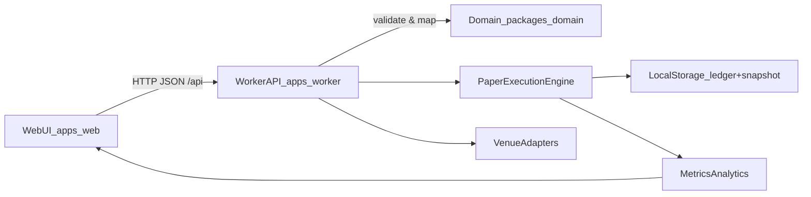

# AI Trading Monorepo (Paper Trading Terminal MVP)

Local-first paper trading terminal with:
- React + Chakra UI web client (`apps/web`)
- Local worker API and deterministic paper engine (`apps/worker`)
- Shared domain contracts (`packages/domain`)

## Purpose

This repo is a **local-first paper trading terminal** for experimenting with discretionary workflows and algorithmic strategies **without touching real money**.

- **Why it exists**: provide a reproducible sandbox for debugging strategy behavior, fills, and metrics.
- **What you can do**: connect a simulated venue, place paper market orders, manage a portfolio, run strategies, and inspect analytics/metrics in the UI.
- **Design constraints**: deterministic-by-default execution (seeded clock + replayable local event log).

## Architecture

### Monorepo layout

- **Web UI**: `apps/web` (React + Chakra UI + Vite)
- **Worker (API + engine)**: `apps/worker` (Express HTTP API + deterministic paper execution engine + strategy runtime + metrics + persistence)
- **Shared domain**: `packages/domain` (TypeScript contracts, events, and validation shared by web + worker via `@ai-trading/domain`)

### End-to-end flow



### Web UI (`apps/web`)

- **Entry points**:
  - `apps/web/src/main.tsx`: app bootstrap (Chakra provider + theme).
  - `apps/web/src/App.tsx`: hash-based routing shell (`/terminal`, `/portfolio`, `/strategies`, `/metrics`, `/connect`).
- **Pages**: `apps/web/src/pages/*Page.tsx` implement the main screens (Terminal, Portfolio, Strategies, Metrics, Connect).
- **Backend dependency**: talks to the local worker at `http://127.0.0.1:4000/api/...` (and uses `/health` for connectivity status).

### Worker API + deterministic engine (`apps/worker`)

- **Composition root**: `apps/worker/src/index.ts`
  - Rehydrates state from local storage (ledger + snapshot) into balances/orders/fills/strategy runs.
  - Creates deterministic execution context from `WORKER_DETERMINISTIC_*` env vars.
  - Wires together the paper engine, venue adapters, strategy runtime, metrics, and the API router.
- **HTTP API surface**: `apps/worker/src/api/router.ts`
  - `/api/connect/*` (local connection state), `/api/portfolio`, `/api/quote`, `/api/orders/*`, `/api/positions`, `/api/fills`, `/api/strategies/*`, `/api/metrics`.
  - Validates inputs using `@ai-trading/domain` validation helpers.
- **Persistence artifacts** (local-first): `apps/worker/.data/ledger.ndjson` and `apps/worker/.data/snapshot.json`

### Shared domain (`packages/domain`)

- **Exports**: `packages/domain/src/index.ts` re-exports:
  - `contracts.ts` (API/request/response types, trading primitives)
  - `events.ts` (domain events used by the worker ledger/runtime)
  - `validation.ts` (request validation helpers used by the worker API)

## Quick Start

1. Install dependencies:

```bash
npm ci
```

2. Start worker and web in separate terminals:

```bash
npm run dev --workspace=@ai-trading/worker
```

```bash
npm run dev --workspace=@ai-trading/web
```

3. Verify worker health:

```bash
curl -s http://127.0.0.1:4000/health
```

Expected response:

```json
{"status":"ok"}
```

## Operator Runbook

### Required Commands

- Lint: `npm run lint`
- Unit/integration tests: `npm run test`
- Build: `npm run build`
- E2E: `npm run test:e2e`
- Full gate: `npm run lint && npm run test && npm run build && npm run test:e2e`

### Environment Keys

Worker (`apps/worker/.env.template` + runtime defaults in `apps/worker/src/index.ts`):
- `PORT` (default 4000)
- `APP_NAME`
- `WORKER_STORAGE_DIR` (default `apps/worker/.data`)
- `WORKER_DETERMINISTIC_SEED` (default `42`)
- `WORKER_DETERMINISTIC_START_TIME` (default `2026-01-01T00:00:00.000Z`)
- `WORKER_DETERMINISTIC_CLOCK_STEP_MS` (default `1`)

Web (`apps/web/.env.template`):
- `VITE_APP_NAME`

### Deterministic Seed Replay Procedure

Use this when you need reproducible fills/metrics for debugging or operator replay:

1. Stop running worker/web processes.
2. Reset worker storage (optional but recommended for clean replay):

```bash
rm -rf apps/worker/.data
```

3. Start worker with explicit deterministic inputs:

```bash
WORKER_DETERMINISTIC_SEED=42 \
WORKER_DETERMINISTIC_START_TIME=2026-01-01T00:00:00.000Z \
WORKER_DETERMINISTIC_CLOCK_STEP_MS=1 \
npm run dev --workspace=@ai-trading/worker
```

4. Re-run the same connect/trade sequence (or run the e2e suite):

```bash
npm run test:e2e
```

5. Confirm deterministic artifacts in storage:
- `apps/worker/.data/ledger.ndjson`
- `apps/worker/.data/snapshot.json`

### Troubleshooting

- `EADDRINUSE: 4000`: stop existing process using port 4000, then restart worker.
- UI shows backend disconnected: confirm worker is running and `/health` returns `{"status":"ok"}`.
- Validation failures on quotes/orders: verify symbol format per venue on Terminal page.
- Replay recovery warnings: inspect `apps/worker/.data/ledger.recovery.ndjson` for malformed/corrupt records.

### Known MVP Limits

- Market orders only (no limit/stop/OCO).
- Simulated adapters only (no live-money execution).
- Connect credentials are local-first MVP handling, not production secret management.
